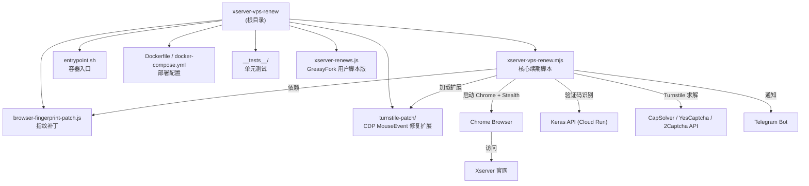

# Xserver VPS 自动续期工具

> 自动为 Xserver 免费 VPS 执行续期操作，基于 Puppeteer Stealth + rebrowser-patches 绕过 Cloudflare Turnstile 检测。

## 变更记录 (Changelog)

| 日期 | 变更内容 |
|------|----------|
| 2026-07-23 | 修复 #5：纯日期误判「明天到期」可续；识别官方「12時間前」拦截页并软跳过，避免误等验证码图 |
| 2026-07-22 | Telegram：每次执行均推送（含无需续期）；`TG_NOTIFY_DETAIL=full\|compact` 控制完整/简洁摘要（#4） |
| 2026-07-20 | 新增 YesCaptcha 作为 Turnstile 可选备选（CapSolver > YesCaptcha > 2Captcha） |
| 2026-07-16 | 文档强调：必须配置 CapSolver API（Turnstile），否则成功率极低 |
| 2026-07-14 | 适配官方 4GB 规则：最长 24h / 剩余≤12h 可续；CAPTCHA_API 默认公共端点；cron 默认每 6h |
| 2026-07-11 | 第二轮打磨：renewal-logic 纯函数、超时可配置、Docker /data 持久化、15 文件 / 209 用例 |
| 2026-07-11 | 第一轮打磨：修复状态文件路径/DEFAULT_UA、utils 纯函数模块、配置校验 |
| 2026-07-11 | 文档同步：测试清单、supercronic、覆盖率阈值、Docker 非 root 运行说明 |
| 2026-06-30 | 初始化架构文档，扫描全仓生成根级 CLAUDE.md |

---

## 项目愿景

通过自动化浏览器操作，按官方 4GB 规则（最长 **24 小时**，剩余 **≤12 小时** 可续期）检查到期状态并在窗口内自动完成续期流程（登录 → 检查到期 → 续期申请 → 验证码识别 → Turnstile 通过 → 提交），避免因忘记续期导致 VPS 被回收。建议调度至少每 6 小时一次。

---

## 架构总览

### 技术栈

| 类别 | 技术选型 |
|------|----------|
| 运行时 | Node.js 22 (ESM) |
| 浏览器自动化 | rebrowser-puppeteer-core + puppeteer-extra Stealth |
| 验证码识别 | Keras 模型 API（Cloud Run 部署） |
| Turnstile 求解 | **CapSolver API（必须配置，否则成功率极低）** / YesCaptcha API（备选） / 2Captcha API（备选） |
| 通知 | Telegram Bot API |
| 容器化 | Docker + docker-compose（非 root `appuser`） |
| 定时调度 | supercronic（容器内，由 `CRON_SCHEDULE` 控制） |
| 测试 | Vitest |
| 依赖更新 | Renovate |
| CI/CD | GitHub Actions → GHCR |

### 目录结构

```
xserver-vps-renew/
├── xserver-vps-renew.mjs      # 编排入口（浏览器操作 + 流程控制 + 通知）
├── src/                       # 可复用模块
│   ├── captcha.mjs            # 验证码处理（标准化/识别/平假名转换）
│   ├── turnstile.mjs          # Turnstile 求解（参数构建/API 调用/token 注入）
│   ├── renewal-status.mjs     # 续期结果持久化与健康检查
│   ├── renewal-logic.mjs      # 续期业务纯逻辑（到期/提交结果/通知文案）
│   └── utils.mjs              # 通用纯函数（脱敏/东京日期/超时 fetch/配置校验）
├── browser-fingerprint-patch.js  # 浏览器指纹注入补丁
├── xserver-renews.js           # GreasyFork 用户脚本版本（参考实现）
├── turnstile-patch/            # Chrome 扩展：修复 CDP MouseEvent 坐标异常
│   ├── manifest.json
│   └── content.js
├── entrypoint.sh               # Docker 入口脚本（定时/单次模式）
├── diagnostics.sh              # 容器网络与环境诊断脚本
├── Dockerfile                  # 容器构建文件（appuser + supercronic）
├── docker-compose.yml          # 容器编排配置
├── package.json                # 依赖与脚本
├── vitest.config.mjs           # 测试配置
├── renovate.json               # 自动依赖更新配置
├── .env.example                # 环境变量模板
├── README.md / CHANGELOG.md / RUNBOOK.md
├── .github/workflows/          # CI/CD
│   └── docker-publish.yml
└── __tests__/unit/             # 单元测试（15 个文件，约 240 个用例）
    ├── buildTurnstileTask.test.mjs
    ├── captcha.recognize.test.mjs
    ├── cleanChromeLocks.test.mjs
    ├── convertHiraganaToNumber.test.mjs
    ├── escapeHtml.test.mjs
    ├── findChromePath.test.mjs
    ├── getTurnstileProvider.test.mjs
    ├── injectTurnstileToken.test.mjs
    ├── normalizeCaptchaCode.test.mjs
    ├── normalizeCaptchaCode.edge.test.mjs
    ├── renewalLogic.test.mjs
    ├── renewalStatus.test.mjs
    ├── turnstile.extract.test.mjs
    ├── turnstile.solve.test.mjs
    └── utils.test.mjs
```

### 系统结构图



---

## 模块索引

| 路径 | 职责 | 入口/关键函数 |
|------|------|---------------|
| `xserver-vps-renew.mjs` | 编排入口（浏览器操作 + 流程控制 + 通知） | `main()`, `handleLogin()`, `checkRenewalNeeded()`, `handleCaptchaPage()` |
| `src/captcha.mjs` | 验证码处理（纯函数） | `normalizeCaptchaCode()`, `convertHiraganaToNumber()`, `recognizeCaptchaWithKerasAPI()`, `recognizeCaptcha()` |
| `src/turnstile.mjs` | Turnstile 求解（纯函数 + 浏览器操作） | `getTurnstileProvider()`, `extractTurnstileParams()`, `buildTurnstileTask()`, `buildCreateTaskPayload()`, `maskTaskForLog()`, `solveTurnstileViaAPI()`, `injectTurnstileToken()` |
| `src/renewal-status.mjs` | 续期持久化（纯函数） | `readRenewalStatus()`, `writeRenewalStatus()`, `buildRenewalRecord()`, `countConsecutiveFailures()`, `getRenewalStatus()` |
| `src/utils.mjs` | 通用纯工具 | `maskProxyAddress()`, `getTokyoDateString()`, `fetchWithTimeout()`, `validateRequiredConfig()`, `parsePositiveInt()` |
| `src/renewal-logic.mjs` | 续期业务纯逻辑（含 24h/12h 政策常量） | `isRenewalDue()`, `parseExpireTimestamp()`, `getRemainingHours()`, `detectRenewalWindowBlocked()`, `extractRetryAfterFromText()`, `buildRenewUrl()`, `evaluateSubmissionResult()`, `extractExpireDateFromText()`, `buildSuccessNotifyMessage` / `buildSkipNotifyMessage` / `buildFailureNotifyMessage` |
| `browser-fingerprint-patch.js` | 浏览器指纹伪装（WebGL/Canvas/Plugins/Connection 等） | `injectBrowserFingerprint(page)` |
| `turnstile-patch/content.js` | 修复 CDP 导致的 MouseEvent.screenX/screenY 异常 | Chrome 扩展 content script |
| `entrypoint.sh` | Docker 容器入口（单次模式 / 定时模式 / supercronic 调度） | `run_renew()`, `cleanup()` |
| `diagnostics.sh` | 容器网络连通性与环境诊断 | 独立诊断脚本 |
| `xserver-renews.js` | GreasyFork 用户脚本版本（浏览器端直接运行参考） | `main()` 路由分发 |

---

## 运行与开发

### 本地运行

```bash
# 安装依赖
npm install

# 配置环境变量
cp .env.example .env
# 编辑 .env 填写 XSERVER_MEMBER_ID、XSERVER_PASSWORD（CAPTCHA_API 可选）

# 单次执行
npm start
# 或
node xserver-vps-renew.mjs
```

### Docker 部署

```bash
# 构建并启动
docker-compose up -d

# 查看日志
docker logs -f xserver-vps-renew

# 手动触发一次续期
docker exec xserver-vps-renew ./entrypoint.sh --once
```

### 测试

```bash
# 运行测试
npm test

# 覆盖率报告
npm run test:coverage

# 监听模式
npm run test:watch
```

---

## 环境变量配置

### 必填

| 变量 | 说明 |
|------|------|
| `XSERVER_MEMBER_ID` | Xserver 会员 ID |
| `XSERVER_PASSWORD` | Xserver 登录密码 |
| `CAPSOLVER_API_KEY` | **CapSolver API 密钥（必须）**：Turnstile 人机验证。未配置时成功率极低（Docker 环境几乎不可用） |

### 可选

| 变量 | 说明 | 默认值 |
|------|------|--------|
| `CAPTCHA_API` | Keras 验证码识别 API 地址（Cloud Run，可自建覆盖） | `https://captcha-120546510085.asia-northeast1.run.app` |
| `YESCAPTCHA_API_KEY` | YesCaptcha API 密钥（Turnstile 备选，仅当无 CapSolver 时） | 无 |
| `YESCAPTCHA_API_BASE` | YesCaptcha API 节点（国际默认；国内可用 `https://cn.yescaptcha.com`） | `https://api.yescaptcha.com` |
| `YESCAPTCHA_TASK_TYPE` | YesCaptcha 任务类型 | `TurnstileTaskProxyless` |
| `TWOCAPTCHA_API_KEY` | 2Captcha API 密钥（Turnstile 求解备选，仅当无 CapSolver / YesCaptcha 时） | 无 |
| `PROXY_TYPE` | 代理类型：http / socks4 / socks5 | 无 |
| `PROXY_ADDRESS` | 代理地址 | 无 |
| `PROXY_PORT` | 代理端口 | 无 |
| `PROXY_LOGIN` | 代理用户名 | 无 |
| `PROXY_PASSWORD` | 代理密码 | 无 |
| `TG_BOT_TOKEN` | Telegram Bot Token | 无 |
| `TG_CHAT_ID` | Telegram Chat ID | 无 |
| `TG_NOTIFY_DETAIL` | 通知详细程度：`full`（完整摘要含过程）/ `compact`（简洁） | `full` |
| `CHROME_PATH` | Chrome 可执行文件路径 | 自动检测 |
| `CHROME_USER_DATA` | Chrome 用户数据目录 | `/data/chrome-profile` |
| `TZ` | 时区 | `Asia/Tokyo` |
| `CRON_SCHEDULE` | Cron 定时表达式（设置后启用定时模式；compose 默认每 6h，适配 12h 续期窗口） | 无（单次模式） |
| `ENABLE_DIAGNOSTICS` | 启用容器环境诊断（true/false） | 无 |
| `RENEWAL_STATUS_FILE` | 续期记录持久化文件路径 | `/data/chrome-profile/renewal-status.json` |
| `ALERT_AFTER_FAILURES` | 连续失败达到此次值时触发告警升级 | `3` |
| `NAVIGATION_TIMEOUT_MS` | 页面导航超时（毫秒） | `30000` |
| `TURNSTILE_TIMEOUT_MS` | Turnstile 自然通过等待超时 | `60000` |
| `TURNSTILE_API_TIMEOUT_MS` | Turnstile API 求解轮询超时 | `120000` |
| `CAPTCHA_MAX_RETRY` | 验证码识别最大重试次数 | `3` |

---

## 核心流程详解

### 续期主流程 (`main()`)

```
启动 → 清理 Chrome 锁文件 → 启动 Chrome (rebrowser + Stealth)
  → 注入浏览器指纹补丁 → 登录 → 检查到期状态
  → [无需续期] 结束
  → [需要续期] 续期确认 → 验证码识别 → Turnstile 求解 → 提交
  → 提取新到期日 → Telegram 通知（成功 / 失败 / 无需续期均推送；`TG_NOTIFY_DETAIL` 控制 full/compact）
```

### 验证码处理 (`handleCaptchaPage()`)

1. 等待验证码图片元素（Base64 内嵌）
2. 调用 Keras API 识别（最多重试 3 次）
3. 验证码标准化（支持平假名转数字、全角转半角、混合内容提取）
4. 模拟人类输入（带延迟）
5. Turnstile 求解（CapSolver / YesCaptcha / 2Captcha API）
6. 提交表单并验证结果

### Turnstile 求解策略

- **必须配置 CapSolver**：`CAPSOLVER_API_KEY`（`AntiTurnstileTaskProxyLess`，不支持代理）。**未配置时成功率极低**，尤其 Docker / 无头环境几乎必然失败
- **备选 YesCaptcha**：`YESCAPTCHA_API_KEY`（`TurnstileTaskProxyless` / `TurnstileTaskProxylessM1`，不支持代理；可用 `YESCAPTCHA_API_BASE` 切国内节点；createTask 自动附带 `softID: 97020`）
- **备选 2Captcha**：`TWOCAPTCHA_API_KEY`（支持代理 `TurnstileTask` 或 `TurnstileTaskProxyless`）
- **优先级**：CapSolver > YesCaptcha > 2Captcha（只启用一家）
- **降级（不推荐）**：无 API 密钥时等待自然通过——生产环境请勿依赖
- 求解成功后注入 token 到页面并触发回调

### 浏览器反检测措施

| 措施 | 实现位置 |
|------|----------|
| rebrowser-patches 修复 Runtime.Enable 泄露 | `rebrowser-puppeteer-core` |
| Stealth 插件隐藏自动化特征 | `puppeteer-extra-plugin-stealth` |
| 浏览器指纹注入（WebGL/Canvas/Plugins 等） | `browser-fingerprint-patch.js` |
| CDP MouseEvent.screenX/screenY 修复 | `turnstile-patch/` Chrome 扩展 |
| 真实 UA（Chrome 149 Edge） | `CONFIG` 中 `DEFAULT_UA` |

---

## 测试策略

- **框架**：Vitest + v8 覆盖率
- **覆盖范围**：`src/**/*.mjs` + `xserver-vps-renew.mjs`
- **已测试模块**（15 个测试文件，约 240 个用例）：
  - `src/captcha.mjs` — `normalizeCaptchaCode`（含边界）、`convertHiraganaToNumber`、`recognizeCaptcha` / `recognizeCaptchaWithKerasAPI`
  - `src/turnstile.mjs` — `getTurnstileProvider`（含 YesCaptcha）、`extractTurnstileParams`、`buildTurnstileTask`、`buildCreateTaskPayload`（softID）、`maskTaskForLog`、`solveTurnstileViaAPI`、`injectTurnstileToken`
  - `src/renewal-status.mjs` — `readRenewalStatus`、`writeRenewalStatus`、`buildRenewalRecord`、`countConsecutiveFailures`、`getRenewalStatus`
  - `src/renewal-logic.mjs` — 到期判定（含 24h/12h 规则与时分解析）、URL 构建、提交结果、到期日提取、通知文案（成功/跳过/失败 + 过程摘要）
  - `src/utils.mjs` — `maskProxyAddress`、`getTokyoDateString`、`fetchWithTimeout`、`validateRequiredConfig`、`parsePositiveInt`
  - `xserver-vps-renew.mjs` — `findChromePath`、`cleanChromeLocks`、`escapeHtml`
- **未覆盖**：端到端浏览器操作流程（登录 / 续期确认 / 完整提交流程需集成测试或手动验证）
- **CI 门禁**（`vitest.config.mjs`）：分支覆盖率 ≥ 25%；functions / lines / statements ≥ 28%

---

## 编码规范

- ESM 模块（`"type": "module"`），使用 `import`/`export`
- 日志统一格式：`YYYY-MM-DD HH:mm:ss` 前缀（东京时区）
- 所有用户可见输出使用简体中文
- 环境变量通过 `CONFIG` 集中管理
- 敏感信息（代理地址、密码）在日志中 mask 处理
- 导出纯函数以支持单元测试

---

## AI 使用指引

- 修改核心流程时，请先理解 `main()` 中的步骤顺序和错误处理逻辑
- 验证码识别和 Turnstile 求解是关键路径，修改需谨慎
- 文档与示例须强调 **必须配置 CapSolver**（`CAPSOLVER_API_KEY`），否则 Turnstile 成功率极低
- 浏览器反检测措施（指纹补丁、CDP 修复）是绕过 Cloudflare 的核心，不宜随意变更
- 新增配置项需同步更新 `.env.example` 和本文档
- 纯函数修改后需补充对应单元测试
- `xserver-renews.js` 是 GreasyFork 用户脚本版本，与主脚本逻辑独立，修改时注意是否需要同步
